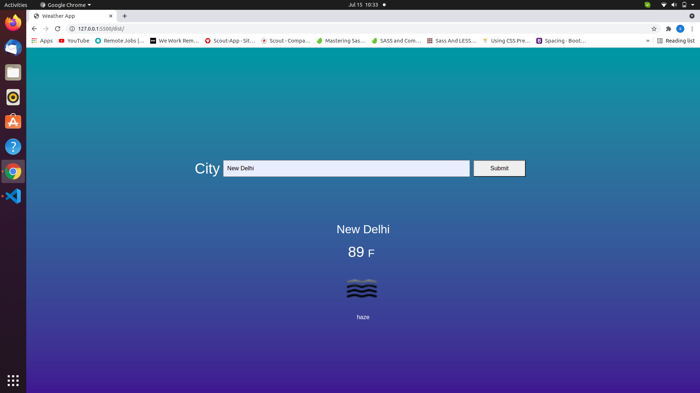

# weather_app
This app seeks desired city weather conditions such as temperature, weather summary and displays it. You can toggle to and fro from C to F in temperature
Weather app pulls from the OpenWeatherMap API to allow users to search for and view the forecast in cities worldwide. Built with JavaScript.

## Built With

javascript

## Getting Started

Download or clone this repo by using :

## $ git clone https://github.com/vidhishweta01/weather_app.git

do follow these steps given below:

1. Change directory to the root of project.

# $ cd waether_app

2. install all development dependencies

## $ npm istall

## Authors 👤

### Shweta Srivastava

_[Github](https://github.com/vidhishweta01)

_[LinkedIn](http://linkedin.com/in/shweta-s-15a57070)

## Show your support ⭐️⭐️
